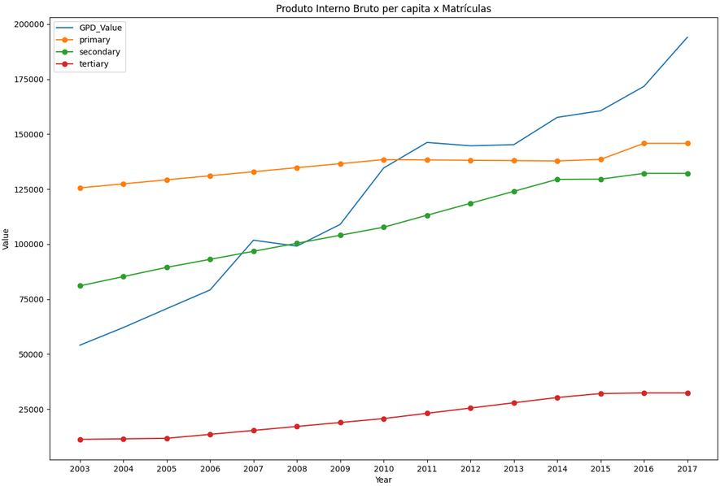

# Programação Aplicada com Python

Práticas realizadas em aula, individual e em quipe. Por exemplo, a um jogo em que o computador escolhe um número aleatório entre 1 e 100, e o jogador tenta adivinhá-lo.

Chegando ao fim deste módulo, foi realizado o exercício: [merge_join](https://github.com/adrielleClemente/engenharia_de_dados/blob/main/Programa%C3%A7%C3%A3o%20aplicada%20com%20Python/merge_join.ipynb), nele contém:

1. Análise exploratória.
2. Transformação dos dataframes.
3. Gráficos dos valores.
4. Visualização de gráficos melhorados.

### Gráfico com interpolação

